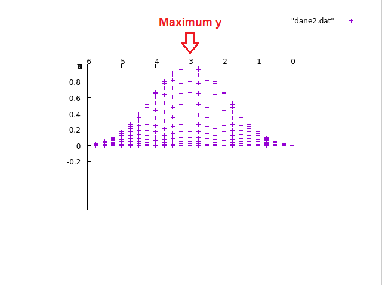

Kuba Walusiak, Juliusz Kościołek
26.03.2022,
Laboratorium 2

- [Wstęp do GSL i GNUPLOT. Interpolacja.](#wstęp-do-gsl-i-gnuplot-interpolacja)
  - [Zad 1](#zad-1)
    - [Polecenie](#polecenie)
    - [Wykonanie](#wykonanie)
  - [Zad 2](#zad-2)
    - [Polecenie](#polecenie-1)
    - [Wykonanie](#wykonanie-1)
  - [Zad 3](#zad-3)
    - [Polecenie](#polecenie-2)
    - [Wykonanie](#wykonanie-2)
  - [Zad 4](#zad-4)
    - [Polecenie](#polecenie-3)
    - [Wykonanie](#wykonanie-3)
  - [Źródła](#źródła)

# Wstęp do GSL i GNUPLOT. Interpolacja.

## Zad 1

### Polecenie

Narysować na jednym wykresie krzywe otrzymane różnymi metodami interpolacji (w przykładzie ustawione
jest `gsl_interp_polynomial`).

### Wykonanie

Uruchomiono program `interpolacja.c`, który wygenerował pliki `wartosci.txt` i `inter.txt`. Następnie modyfikowaliśmy
typ interpolacji w programie kolejno na sześcienną funkcję sklejaną oraz liniową:

```c
gsl_spline *spline = gsl_spline_alloc(gsl_interp_cspline, steps + 1);
```

```c
gsl_spline *spline = gsl_spline_alloc(gsl_interp_linear, steps + 1);
```

Wyniki zapisywano do plików `inter-polynomial.txt`, `inter-cspline.txt` oraz `inter-linear.txt`.

Następnie użyto programu `gnuplot` do wygenerowania wykresu prezentującego zadane punkty z pliku `wartosci.txt` oraz
wygenerowane interpolacje:

```
gnuplot> plot "wartosci.txt", "inter-cspline.txt" with lines, "inter-linear.txt" with lines, "inter-polynomial.txt" with
lines
```

Wygenerowany wykres prezentuje poniższa grafika:


## Zad 2

### Polecenie

Przy pomocy gnuplot proszę narysować dane zgromadzone w pliku `dane1.dat`. Aby wykres byl czytelny, jedna z osi musi
mieć skale logarytmiczna. Proszę ustalić, która to oś i narysować wykres.

### Wykonanie

Polecenie użyte do narysowania wykresu:

```
gnuplot> set logscale x
gnuplot> plot "dane1.dat" with lines
```

Użyto funkcji `auto-zoom` programu gnuplot.


## Zad 3

### Polecenie

Proszę narysować wykres funkcji dwuwymiarowej, której punkty znajdują się w pliku dane2.dat. Proszę przeglądnąć plik i
spróbować znaleźć w nim maksimum. Potem proszę zlokalizować maksimum wizualnie na wykresie. Proszę na wykresie zaznaczyć
maksimum strzałką.

### Wykonanie

Użyto programu gnuplot. Na początku ustawiono nazwy osi:

```
gnuplot> set xlabel "x"
gnuplot> show xlabel
gnuplot> set ylabel "y"
gnuplot> show ylabel
gnuplot> set zlabel "z"
gnuplot> show zlabel
```

Następnie narysowano wykres:

```
gnuplot> splot "dane2.dat"
```

Domyślny (punktowy) format wykresu okazał się zadowalający. Po odpowiednich rotacjach wizualnie zlokalizowano maksimum
na osi `X` (`4`)
i maximum na osi `Y` (`3`).

Rotacja pozwalająca na wizualne wyznaczenie maksimum `X`:


Rotacja pozwalająca na wizualne wyznaczenie maksimum `Y`:



Rotacja pokazująca cały wykres w trójwymiarze:


## Zad 4

### Polecenie

Proszę odtworzyć wykres znajdujący się na rysunku:


### Wykonanie

Ustawiono tytuł i legendę:

```
gnuplot> set title "Wykres testowy"
gnuplot> set key left top
gnuplot> set key box lt rgb "black" lw 1
```

Ustawiono oś i zakres wykresu:

```
gnuplot> set ylabel "Amplituda"
gnuplot> show ylabel
gnuplot> set xrange [-3:3]
gnuplot> set yrange [-4:5]
```

Finalna komenda rysująca wykres. W przypadku danych z "fun1.txt" należało zmienić postać wartości z `(x, ymin, ymax)`
na `(x, y, ymin, ymax)`

```
gnuplot> plot "fun1.txt" using 1:(($3+$2)/2):2:3 with yerrorbars lt rgb "red" title "Dane z pliku fun1.txt", \
    sin(x**5) lt rgb "green" title "funkcja2: sinus(x^5)", \
    2*cos(x*sin(x)) lt rgb "blue" title "funkcja1: 2*cos(x*sin(x))" with boxes, \
    3*sin(x) lt rgb "red" title "funkcja3: 3*sin(x)"
```


## Źródła

Użyte źródła:

- [Dokumentacja typów interpolacji w GSL](https://www.gnu.org/software/gsl/doc/html/interp.html)
- [Dokumentacja gnuplot 5.5](http://gnuplot.info/docs_5.5/gnuplot5.html)
- [Jak przesunąć legendę?](https://stackoverflow.com/questions/12208054/gnuplot-legend-overlaps-graph)